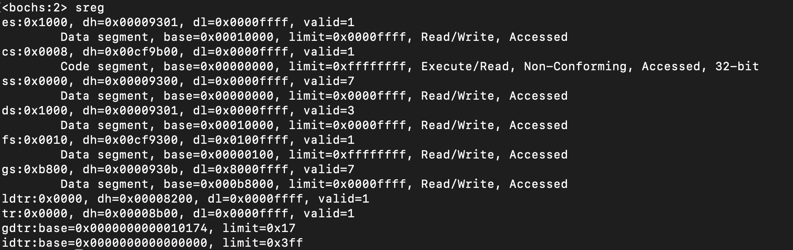
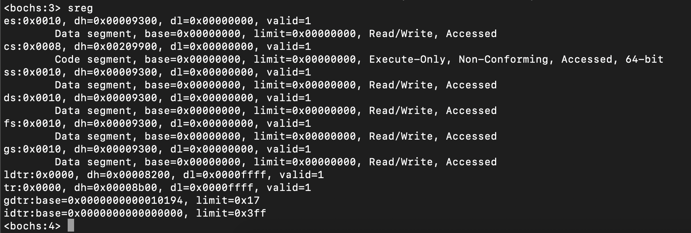
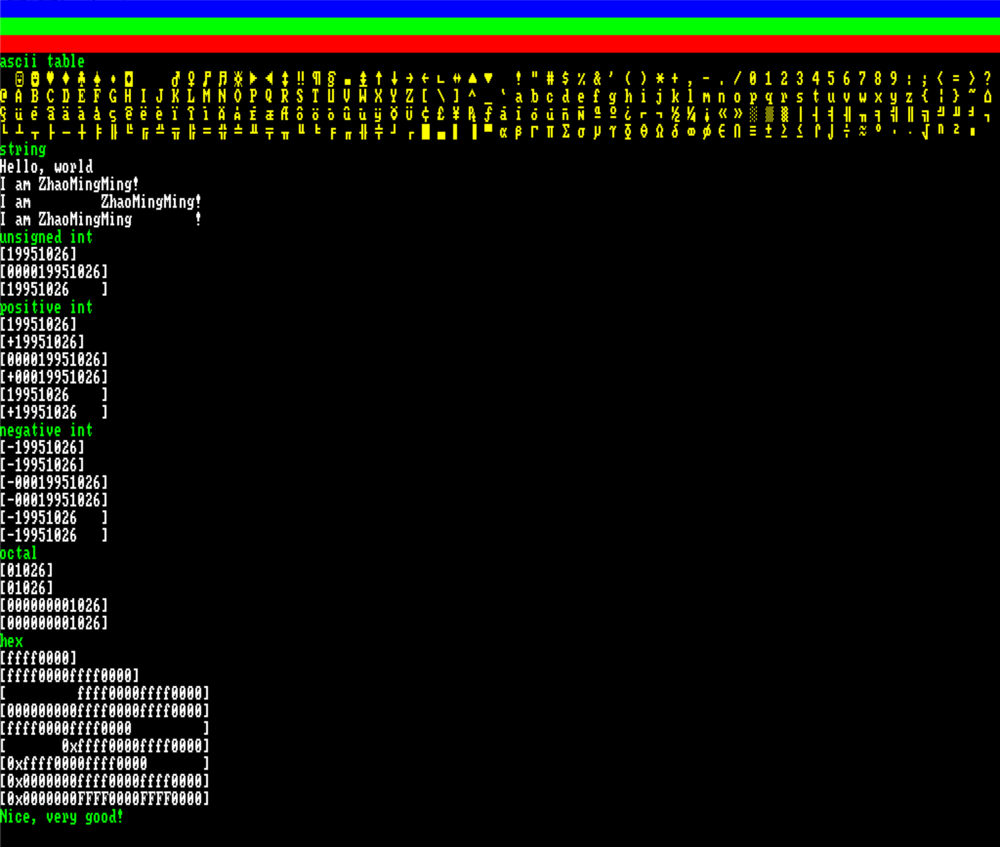

# MatchaOS
阅读《一个64位操作系统的设计与实现》, 自制操作系统. 

## 环境
### 编译环境

操作系统: CentOS

Mac或Windows操作系统推荐在Docker中安装CentOS镜像, 在容器中编译.

示例:
```bash
docker search centos
docker pull centos:centos7
docker run -it -v MatchaOS_path:/root/MatchaOS -h master centos:centos7 /bin/bash

yum install -y gcc
yum install -y make

cd /root/MatchaOS/src/boot/ && make
cd /root/MatchaOS/src/kernel/ && make
```

### 运行
编译后, 可以直接执行`start.sh`脚本, 在boches虚拟机启动matchaOS.
```bash
cd MatchaOS_path
sh start.sh
```

> Mac中, 如果使用Qemu的话, 启动会出现问题, 暂时没有解决.

## 部分截图
(boot)

启动boot


加载并执行loader


(loader)

切换至保护模式


切换至长模式


(kernel)

配置了一套ASCII字体, 并实现格式化打印消息
   

## 参考资料
1. [(参考书源代码) MINE操作系统](https://gitee.com/MINEOS_admin)
2. [清华大学操作系统实验ucore_os_lab](https://github.com/chyyuu/ucore_os_lab)
