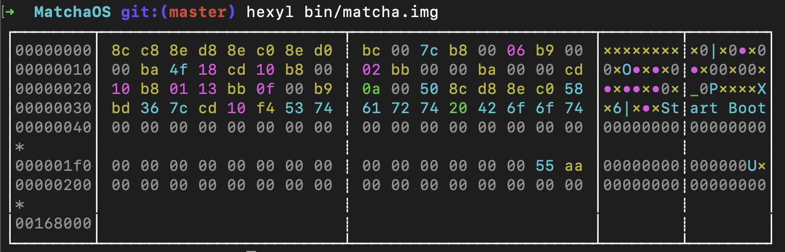
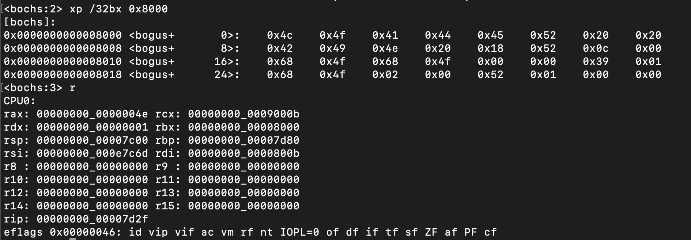
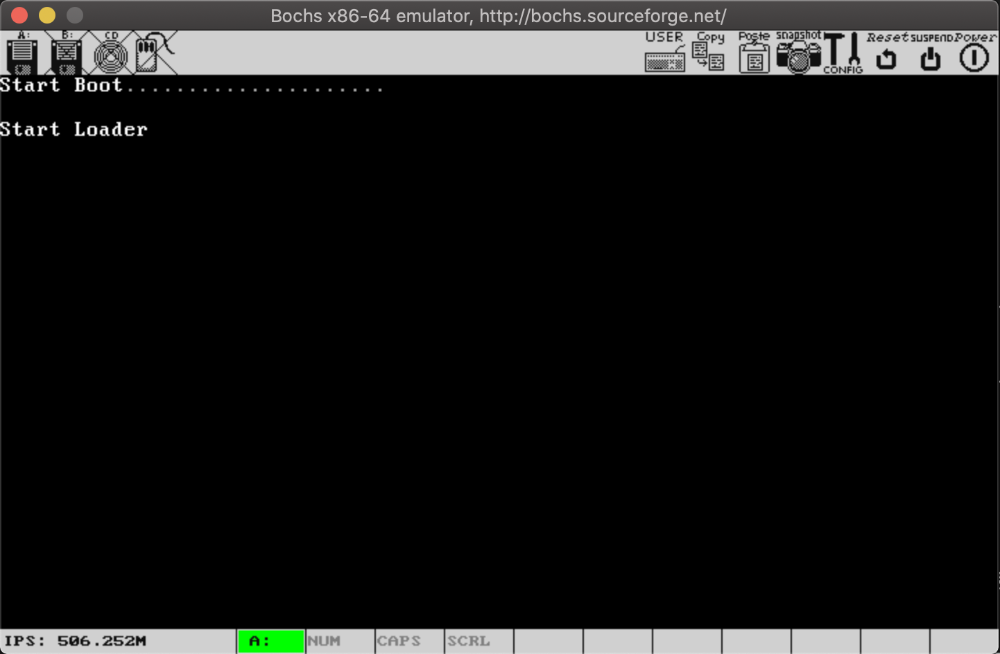

# boot引导程序

## 计算机启动过程
1. 计算机开机时, 会将CS:IP指向0xFFFF0(ROM BIOS映射区, 其中CS=0xF000, IP=0xFFF0).
2. BIOS执行, 进行键盘、显示器、软盘、硬盘等硬件的检查. 比如软盘启动时, 会检查磁盘的第一个扇区(boot sector)的最后两个字节是否为`0xaa`, `0x55`.
3. 将磁盘第一个扇区中的数据(boot引导程序)读入内存0x7C00处, 并跳转至0x7C00处, 执行boot引导程序.


下图bochs模拟器启动时, CS:IP已经指向了0xFFFF0 

## boot引导程序

### 屏幕控制
在boot引导程序中, 可以借助BIOS`int 10h`中断服务程序, 来控制屏幕的显示信息. 
1. `int 10h, ah=06h` 进行屏幕滚动, 可实现清屏
2. `int 10h, ah=02h` 设置光标位置
3. `int 10h, ah=0Eh` 显示一个字符
4. `int 10h, ah=13h` 显示字符串

boot程序中, 清屏后, 设置光标位置, 并显示'Start Boot'. 效果如下图:


下图是镜像文件`matcha.img`的16进制数据, 可见第一个扇区存储的是boot引导程序, 后两个字节分别是`0xaa`, `0x55`


### 扇区读取
```asm
; 软盘结构
; |---------------------|
; |2879                 |
; |                     |
; |        Data         |
; |                     |
; |33                   |
; |---------------------|
; |32                   |
; |                     |
; |      Root Dir       |
; |        (14)         |
; |19                   |
; |---------------------|
; |18                   |
; |        FAT2         |
; |10                   |
; |---------------------|
; |9                    |
; |        FAT1         |
; |1                    |
; |---------------------|
; |0    Boot Sector     |
; |---------------------|
```
软盘大小为1.44M, 共计2880个扇区, 每个扇区512字节. 第一个扇区(引导扇区)存放的就是boot引导程序.

由于boot引导程序最大, 不超过512字节(去除FAT文件系统结构), 并不能处理很多的事情. 比如说模式转换, 分页, 读取内存信息等等. 要将这些功能放在loader程序中去执行. 这就是从软盘中读取到loader程序, 并加载到内存中.


BIOS`int 13h, ah=02h`中断服务程序, 可以进行读取扇区, 相关参数如下:
```
INT 13h, AH=02h
AL = 读入扇区数
CH = 磁道号(柱面号)的低8位
CL = 磁道号(柱面号)的高2位(bit 6~7, 硬盘有效), 扇区号(0~5bit)
DH = 磁头号
DL = 驱动器号
ES:BX = 数据缓冲区
```

### loader文件加载至内存

FAT文件系统根目录区(Root Dir)的目录项(Entry)存储着文件相关信息,如下:
```asm
; Root Dir structure(32-bit)
; ---------------------------------------------------------------------------------------
; |0       10|    11    |12  21|22         23|24         25|26         27|28          31|
; | Dir_Name | DIR_Attr | RSVD | DIR_WrtTime | DIR_WrtDate | DIR_FstClus | DIR_FileSize |
; ---------------------------------------------------------------------------------------
```
`Dir_Name`是文件名, 11-bit, 只包含文件名和文件扩展名. 文件名在前扩展名在后. 示例如下
```
"loader.bin" -> "LOADER  BIN"
".bin"       -> "        BIN"
"loader."    -> "LOADER  BIN"
```
`Dir_FstClus`是文件所在簇号(cluster, 由一组逻辑连续的扇区组成). 因为0x0000, 0x0001是两个保留簇, 因此数据区有效簇号是从0x0002开始, 即簇号0x0002对应的起始扇区号为33.

当一个文件大小大于一个簇时, 需要多个簇进行存储. 这时就需要根据当前簇号从FAT1表中索引出下一个簇号. 可将其看成一个数组, 索引代表当前簇号, 值代表下一簇号. 当下一簇号为`0x0fff`时, 代表文件结束.

如下是loader.bin在软盘中跟目录区目录项的值, 前11个字节为`LOADER  BIN`(两个空格) 


确定了存放loader文件的扇区后, 就可以借助`int 13h, ah=02h`中断程序, 将扇区读取至内存中了, 这里将ES:BX设为[0x1000:0], 即将其加载至物理内存0x10000处, 之后借助跳转指令`jmp`跳转至0x10000处执行loader程序. 至此boot程序的使命也就完成了.

### 执行结果


## 参考资料
1. [Microsoft FAT Specification](http://read.pudn.com/downloads77/ebook/294884/FAT32%20Spec%20%28SDA%20Contribution%29.pdf)


