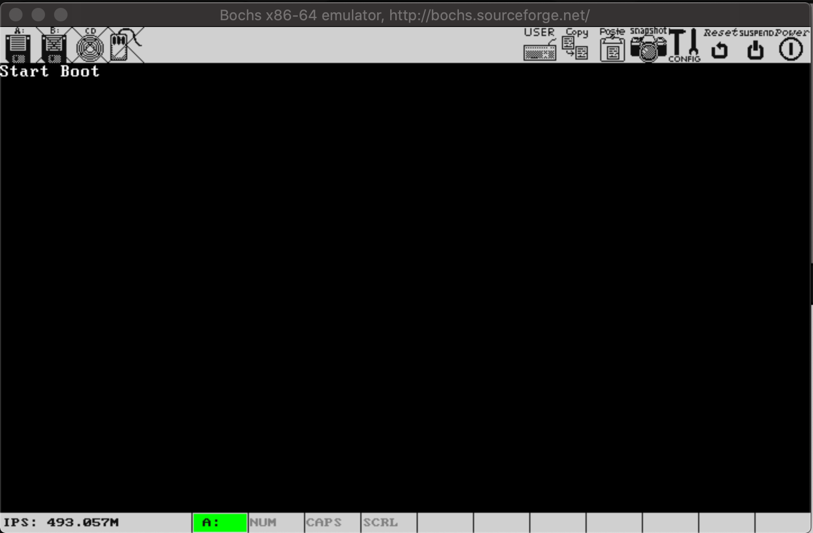

# boot引导程序

## 计算机启动过程
1. 计算机开机时, 会将CS:IP指向0xFFFF0(ROM BIOS映射区, 其中CS=0xF000, IP=0xFFF0).
2. BIOS执行, 进行键盘、显示器、软盘、硬盘等硬件的检查. 比如软盘启动时, 会检查磁盘第0磁道第0扇区(第一个引导扇区)的最后两个字节是否为`0xaa`, `0xff`.
3. 将磁盘第一个扇区中的数据(boot引导程序)读入内存0x7C00处, 并跳转至0x7C00处, 执行boot引导程序.

下图bochs模拟器启动时, CS:IP已经指向了0xFFFF0 

## boot引导程序

### 屏幕控制
在boot引导程序中, 可以借助`int 10h`中断服务程序, 来控制屏幕的显示信息. 
1. `int 10h, ah=06h` 进行屏幕滚动, 可实现清屏
2. `int 10h, ah=02h` 设置光标位置
3. `int 10h, ah=13h` 显示字符串

boot程序中, 清屏后, 设置光标位置, 并显示'Start Boot'. 效果如下图:

