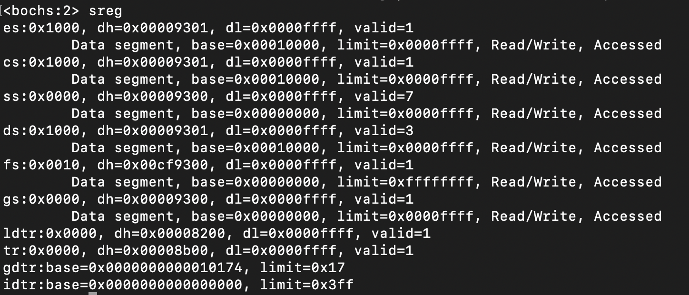

# Loader引导加载程序

## 扩展FS段寄存器寻址空间

### 开启地址A20功能
在实模式下, 默认只能寻址1MB以内的地址空间. 由于早期处理器只有20位地址线,寻址超过1M时, 只有低20位有效. 需要开启地址A20功能, 扩展寻址能力.
方法有好几种, 这里采用置位0x92端口第一位的方式
```asm
; open address A20
in      al, 92h
or      al, 0010b       ; 置位0x92端口第一位, 使20位以上地址有效
out     92h, al
```

### 加载临时描述符

实模式下, 寻址方式采用的是`段选择子>>4 + 偏移`. 而保护模式下(32位寻址, 4G地址空间)采用的是分段的方式, 根据段选择子中的索引, 从GDT(Global Descriptor Table)中索引出全局描述符(64-bit), 根据描述符中的基地址加上偏移来寻址. 同时描述符中也会有一些权限相关信息, 是寻址更加安全.

保护模式下段描述符位功能说明:
```asm
; ---------------------------------------------------------------------------------
; |63                               56| 55 | 54  | 53 |  52  |51                48| 
; |          段基(Base 31:24)         | G  | D/B | L  |  AVL |  段长(Limit 19:16) |
; ---------------------------------------------------------------------------------
; | 47 |46   45| 44 |43             40|39                                       32|
; | P  |  DPL  |  S |      Type       |             段基(Base 23:16)              |
; ---------------------------------------------------------------------------------
; |31                                                                           16|
; |                             段基(Base 16:00)                                  |
; ---------------------------------------------------------------------------------
; |15                                                                            0|
; |                             段长(Limit 15:00)                                 |
; ---------------------------------------------------------------------------------	
; 
; G    段限长的颗粒度, 置位以4kb为颗粒度,段长度为4KB~4GB; 复位时以字节为颗粒度, 段长度1B~1MB
; D/B  标识代码/数据/栈段操作数位宽, 32位为1, 16位为0
; P    表示段已在内存中
; DPL  特权级(优先级), 0~3, 0为最高特权级 
; S    置位为代码/数据段, 复位为系统段
; Type S置位时, 43位置位表示代码段, 43位复位, 表示数据段
;      42位一致性标志位, 41位可读标志位, 40位访问标志位
```
段选择子位功能说明:
```asm
; -----------------------------------
; |15                    3| 2 |1   0|
; |   段选择子索引Index   | TI| RPL |
; -----------------------------------
;
; TI  描述符类型, 0=GDT, 1=LDT
; RPL 请求特权级(Requested Privilege Level)
```
  
如下是一个临时的描述符表, 定义了三个描述符: 第一个是空段描述符(不用管); 第二个是代码段(S=1,Type=10),其选择子是0x8; 第三个是数据段(S=1,Type=2), 其选择子是0x16.
其中代码段和数据段描述符的P均为1, 表明寻址空间为4G.
```asm
[SECTION gdt]
LABEL_GDT:		dd 0,0
LABEL_DESC_CODE32:	dd 0x0000FFFF,0x00CF9A00	; 代码段Base=0, Limit=0xFFFFF(4kb颗粒度)
LABEL_DESC_DATA32:	dd 0x0000FFFF,0x00CF9200	; 数据段Base=0, Limit=0xFFFFF(4kb颗粒度)

GdtLen	equ	$ - LABEL_GDT
GdtPtr	dw	GdtLen - 1
	dd	LABEL_GDT

SelectorCode32	equ LABEL_DESC_CODE32 - LABEL_GDT	; 代码段选择子, 值为0x8
SelectorData32	equ LABEL_DESC_DATA32 - LABEL_GDT	; 数据段选择子, 值为0x10
```
借助`lgdt`指令, 可将描述符表加载至GDTR寄存器中, 高32位存放描述符基地址, 低16位存放描述符长度.
```
lgdt	[GdtPtr]
```

### 开起保护模式
置位cr0第0位, 可以开启保护模式
```asm
; 置位cr0第0位, 开启保护模式
mov	eax, cr0
or	eax, 1
mov	cr0, eax

; 加载数据段选择子至fs段寄存器
mov	ax, SelectorData32
mov	fs, ax
```

### 结果
FS段选择子为`0x10`, 基地址为`0x00000000`, 限长`0xffffffff`. 可见FS段寄存器已经有了4G的寻址能力.

